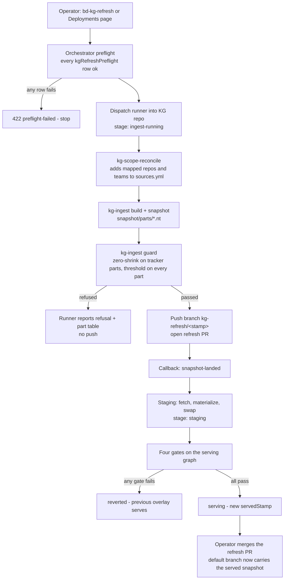

# The refresh rail — how a KG repo is built, proven and served

This document describes the knowledge-graph refresh **from the KG repo's side**: what the
orchestrator does to a repo created from this template, what the repo must provide so that
the orchestrator can do it, and the one rule the whole flow enforces.

> **The rule.** Every change to a KG repo is proven by a rail dry-run before it merges. A
> snapshot reaches the serving graph only through the rail. No laptop ingest, no laptop push.

The orchestrator side (routes, stages, persistence, gates) is documented in AI-Implement's
`docs/kg-architecture.md`. The operator skills (`bd-kg-refresh`, `bd-mega-kg-refresh`,
`bd-kg-create`) are documented in the BuildDown skills repo. This page is the contract between
the three.

## Actors

| Actor | Role |
|---|---|
| **KG repo** (this template, or a derivative created by `bd-kg-create`) | Holds `sources.yml`, the ingesters, the guard, the snapshot parts, and the MCP server code. Its default branch is the only source of served data. |
| **Orchestrator** (AI-Implement) | Runs the rail: preflight, dispatch, guard, refresh PR, staging, gates, serving. Runs the KG sidecar built from this repo. Owns the PR-triggered dry-run check. |
| **Runner** | A one-shot job the orchestrator dispatches into the KG repo. Clones the repo, reconciles scope, runs `kg-ingest`, runs the guard, pushes a snapshot branch and opens the refresh PR. |
| **GitHub App** | The identity the orchestrator and runner use on the KG repo and on this base repo. Its permissions gate what the rail can do (see *One-time setup*). |
| **Operator** | An admin on the orchestrator. Triggers refreshes, accepts a new baseline, merges refresh PRs, writes learnings. |

## The flow

### Step by step

1. **Trigger.** An admin calls `trigger_kg_refresh` (MCP), `POST /api/kg/refresh`, or presses
   *Refresh graph now*. `202` means accepted. `409` means a refresh or a deploy is already
   running. `422` names the gate that refused.
2. **Preflight.** The orchestrator probes every grant the rail needs (table below). One failing
   row refuses the trigger. The `base:drift` row is advisory and never refuses.
3. **Dispatch.** The runner clones the KG repo's default branch.
4. **Scope reconcile.** The runner adds every orchestrator-mapped repo and team that is missing
   from `sources.yml`. It never removes an entry and never touches `docs_sites` or
   `code_repo.docs_url`. The delta is written to the refresh PR's `### Scope` section.
5. **Ingest.** `kg-ingest build` then `kg-ingest snapshot` write `snapshot/parts/*.nt` and
   `snapshot/digest.md`.
6. **Guard.** `kg-ingest guard` compares the new parts with the parts on the default branch.
   The rules are in [snapshot-guard.md](snapshot-guard.md). A refusal stops the run before any
   push and carries the per-part table back to the orchestrator.
7. **Push and PR.** The runner pushes `kg-refresh/<stamp>` and opens the refresh PR.
8. **Staging and gates.** The orchestrator fetches the pushed snapshot, materializes it beside
   the serving graph, swaps by rename and restarts the sidecar. Four gates run on the new graph:
   the sidecar answers, the vectors are present, a canary query is non-empty and not degraded,
   and the served stamp is strictly newer. A failed gate reverts to the previous overlay.
9. **Merge.** The operator merges the refresh PR. The default branch now carries what is
   served. The next image build reads it.

A refresh takes about 15 minutes on GitHub Actions.

### The refresh PR

| Field | Value |
|---|---|
| Branch | `kg-refresh/<stamp>`, stamp in compact form, for example `20260913T225443Z` |
| Title | `kg-refresh: snapshot @ <stamp> (<N> quads)` |
| Body | `## kg-refresh report — <stamp>`, then the guard verdict, the per-part line-count table (`Part | Prev | New | Delta`), quads serialized, issues by team, secondary repositories with their SHAs, `### Scope`, `### Ingest warnings` |
| `### Baseline` | Present only when an admin accepted a new baseline for this run: who accepted, and the table they accepted |
| Learnings comment | `# ai-implement-kg-refresh-learnings`, posted only when the rail detected an anomaly |

The PR title carries no issue key. Linear moves a Done issue back to In Progress when a PR
title names it.

## Dry-run and the PR check

A **dry-run** is the same runner job with the push skipped. The guard runs against the freshly
ingested snapshot. The verdict and the part table land on `get_kg_status.lastRefresh` with
`dryRun: true`. `servedStamp` and the default branch do not change.

Three ways to get one:

| Path | Who | What it proves |
|---|---|---|
| `trigger_kg_refresh { dryRun: true }` | Admin, by hand or from `bd-kg-refresh` step 6 | The default branch ingests and passes the guard today |
| **Dry-run refresh** button on the Deployments page | Admin | Same |
| **PR check** on the KG repo | Automatic, from the GitHub webhook | The PR's head ingests and passes the guard |

The **PR check** runs when a PR on the bound KG repo, or on the configured base template repo,
touches `kg_ingest/**`, `sources.yml`, `ontology/**` or `snapshot/**`, or when its head branch
matches `kg-upstream/*` or `sync/upstream-*`. It fires on `opened` and `synchronize`. A PR that
touches nothing guard-relevant gets no dispatch.

The verdict lands twice:

- A **sticky comment** headed `## kg-refresh dry-run — <sha>`. It carries the verdict line
  and a `part | prev | new` table. It is edited in place on every push.
- A **commit status** with context `kg-refresh/dry-run`. It appears only when the GitHub App
  holds *Commit statuses: Read and write* on that repo. Without the grant the check is
  comment-only. It never blocks the dispatch.

The `accept-baseline` **label** is report-only. It changes the comment wording to "refused,
accepted by label" and flips the status to success. It does not change what the guard decides
and it does not let a real refresh past a shrink.

The **required check** is optional. The orchestrator never edits branch protection. A repo
admin can add `kg-refresh/dry-run` as a required context by hand. BuildDownAI has chosen not to
add GitHub-side dependencies for now, so the check is informational there.

### Accepting a new baseline

When a part legitimately shrinks (a repo was removed from scope, a classifier tightened), the
guard refuses with `KG_SNAPSHOT_TRACKER_REGRESSION`. The one sanctioned way past it is
`trigger_kg_refresh { acceptNewBaseline: true }`, once, by an admin who can name the change.
The refresh PR then carries a `### Baseline` section with the admin's identity and the table.
`bd-kg-refresh` asks exactly one question before it does this and never accepts twice in a
session. Run `bd-mega-kg-refresh` first when a shrink is expected, so the proof loop shows the
delta before anything is accepted.

## What this repo must provide

The rail and the sidecar depend on these contracts. A derivative that changes one of them
breaks its own refresh.

| Contract | Where | Consumer |
|---|---|---|
| `sources.yml` with `namespace`, `code_repo`, `secondary_repos`, `trackers`, optional `base_repo:` | repo root | Scope reconcile, ingest, `base:drift` |
| `kg-ingest build` / `snapshot` / `guard` / `materialize` console scripts | `pyproject.toml`, `kg_ingest/` | Runner and staging |
| `snapshot/parts/*.nt` plus `snapshot/digest.md`, one part per node type | `snapshot/` | Guard, materialize, image build |
| The guard's golden table and exit codes | `kg_ingest/guard.py`, [snapshot-guard.md](snapshot-guard.md) | Runner, PR check |
| `kg-query serve` exposing exactly these six tools: `kg_search`, `kg_semantic_search`, `kg_hybrid_search`, `kg_neighbors`, `kg_provenance`, `kg_path` | `kg_query/server.py` | Orchestrator `/mcp` proxy and boot probe |
| Streamable-HTTP **stateless** mode with JSON responses when `KG_HTTP` is set | `kg_query/server.py` | Orchestrator proxy (see *Sidecar liveness*) |
| Tests that pass under the default namespace and a custom one | `tests/` | CI on `testing` |

### `base_repo:` in `sources.yml`

The advisory `base:drift` preflight row reads `base_repo:` from the derivative's `sources.yml`
to count how many commits it is behind the template. When the key is absent the orchestrator
uses `BuildDownAI/bd-knowledge-graph-base`. This template ships without the key. A derivative
that tracks a fork of the base must set it.

This is a different setting from the orchestrator's **Base template repo** field (Settings →
KG Refresh, seeded once from `KG_BASE_REPO`). That field tells the PR check which incoming
repository counts as a base-template PR, and tells the preflight which second repo to probe for
`statuses:write`. The two normally agree. Nothing reconciles them.

## Sidecar liveness

The orchestrator runs the MCP server from this repo as a sidecar and proxies each tool call as
one session-less `POST`. Two facts follow.

**The server runs stateless.** FastMCP's HTTP transport is stateful by default and answers a
`POST` without a prior `initialize` with `400 Missing session ID`. With `KG_HTTP` set the
server sets `stateless_http = True` and `json_response = True`. The `mcp` dependency is pinned
to the range where both settings exist and were tested. Raising the pin is a guard-relevant
change: prove it with the dry-run and a real image build before it merges.

**The orchestrator probes at boot.** After the sidecar starts, the orchestrator calls
`tools/list` and expects the six `kg_*` names above, then calls `kg_neighbors` on the graph
spine. The probe sends `Accept: application/json, text/event-stream`. A stateless server
answers `406` without that header. The result is recorded and surfaced on every health read:

| Surface | Field |
|---|---|
| `GET /`, `get_kg_status`, `get_tenant_health`, `/api/kg/status` | `kgUnavailable`, `sidecar: { reachable, toolsListed, lastError, checkedAt }` |
| Deployments page | The `KG sidecar` line on the Knowledge graph card |
| Deploy notification | `⚠️ KG sidecar not serving — <lastError>` |
| Deploy record | `deployed-not-serving` when the probe fails |

A sidecar that boots, answers health and lists tools but rejects calls used to look green. The
probe and the stateless setting close that class together. The detail is in AI-Implement's
`docs/deployment.md`, section *KG sidecar health*.

## One-time setup for a new KG repo

Done once per repo by an org owner or an orchestrator admin. `get_tenant_health` reports each
item as a `kgRefreshPreflight` row. Every row must read `ok: true` before the first refresh.

| Row (`repo` · `grant`) | What satisfies it |
|---|---|
| KG repo · `workflow:envelope` | `.github/workflows/claude-implement.yml` on the default branch is on the envelope contract (declares `run_config`). Fix: re-run workflow sync for the KG repo mapping (`trigger_workflow_sync`, or `POST /api/mappings/<team>/sync-workflows`) |
| KG repo · `contents:write` | The GitHub App is installed on the repo with *Contents: Read and write* |
| KG repo · `statuses:write` | The App holds *Commit statuses: Read and write* and the installation accepted the update |
| Base template repo · `statuses:write` | Same grant on this base repo |
| Base template repo · `base:drift` | Advisory. `sources.yml` `base_repo:` (or the default) resolves and can be fetched |
| Every `code_repo` / `secondary_repos` slug · `contents:read`, `pull_requests:read` | The App can read each repo the ingest clones |

Also required, and not reported by a preflight row:

- **Orchestrator settings:** `KG_SOURCE_REPO` (the KG repo slug) and `KG_BASE_REPO` (seeds the
  *Base template repo* field on first boot; set the field by hand if the variable was never set).
- **Allowlist:** the operator's account holds role `admin` on the orchestrator.
  `get_session_identity` shows the resolved role.
- **Webhook:** the KG repo's pull-request events reach the orchestrator, so the PR check fires.

GitHub App permissions live on the App, not on repositories. A permission change takes effect
after the installation accepts it.

## Base and derivative

- **Base first, always.** A mechanism lands in this template, then derivatives merge it:
  `git fetch upstream && git merge upstream/main` on a `kg-upstream/<date>` branch. That branch
  name is guard-relevant by definition, so the PR check runs the dry-run on every upstream
  merge before it lands.
- **Drift is visible.** The `base:drift` row and `bd-kg-refresh` step 4 report how many
  commits a derivative is behind. `bd-mega-kg-refresh` performs the merge.
- **The template flag.** The base repo is marked *Template repository* on GitHub. That is what
  `bd-kg-create` copies from. The `base:drift` row compares default branches through the
  GitHub compare API; it does not read the flag.
- **Branches.** This repo's PRs target `testing`. `main` is the release line that derivatives
  merge from. A derivative may use `main` as its only branch; the rail reads whatever the
  orchestrator's mapping names as the default branch.

## The learnings loop

An uneventful refresh files nothing. When a run surfaces an ingest failure class, a classifier
miss, a portability gap, a search-quality pattern or a process defect, the operator writes one
sanitized note under `learnings/YYYY/MM/DD-<project-slug>.md` and opens a PR into `testing`.
The PR stays open until a maintainer approves it. Rules and dispositions: `CONTRIBUTING.md`
and `learnings/README.md`.

## Where the rest lives

| Topic | Document |
|---|---|
| Orchestrator stages, persistence, gates, dry-run plumbing, PR-check internals, App permission walkthrough | AI-Implement `docs/kg-architecture.md` |
| Sidecar image build, `/mcp` OAuth, memory sizing, boot-probe fields | AI-Implement `docs/kg-sidecar.md`, `docs/deployment.md` |
| Operator procedure: preflight, trigger, poll, accept-new-baseline, verify live | skills `plugin/skills/bd-kg-refresh/SKILL.md` |
| Local ingest iteration and the proof loop | skills `plugin/skills/bd-mega-kg-refresh/SKILL.md` |
| Guard rules and the golden table | [snapshot-guard.md](snapshot-guard.md) |
| Ingest pipeline | [ingest.md](ingest.md) |

## Lineage

The rail and its proofs were built across three trackers in September 2026. In this repo:
KGB-25 shipped the guard, KGB-26 the golden delta test, KGB-27 the typed lexical leg of
search, KGB-28 the stateless sidecar transport. The orchestrator side is the AII-630 family
(dry-run, PR check, accept-new-baseline, preflight rows, sidecar probe and surfacing). The
skills side is BDS-47 through BDS-67.
